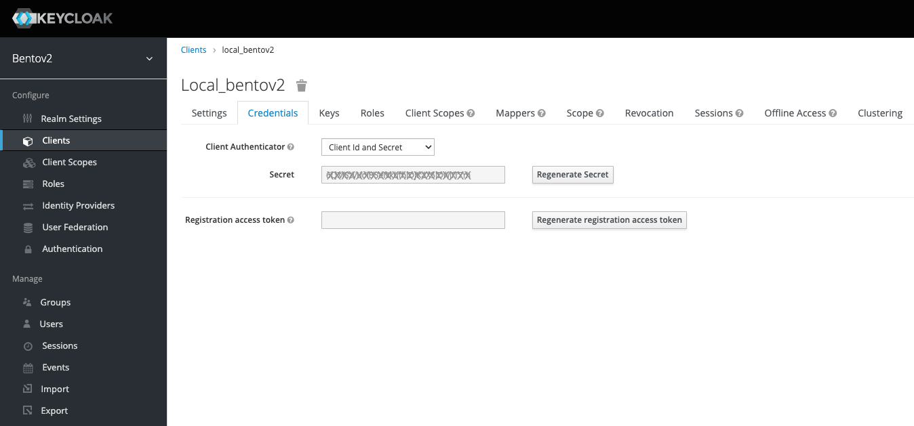

# bento v2
This repo is intended to be the next generation of Bento deployments.
Originating from the blueprints in the repo `chord_singularity`, `bentoV2` aims to be much more modular than it's counterpart, built with docker instead of Singularity.


<div style="text-align:center">
  
</div>


## Makefile
The Makefile contains a set of tools to faciliate testing, development, and deployments. Ranging from `build`, `run`, and `clean` commands, operators may have an easier time using these rather than fiddling with raw `docker` and `docker-compose` commands.

## Requirements
- Docker >= 19.03.8
- Docker Compose >=1.29.0

## Installation

### Provision configuration files

Depending on your use either development or deployment you will need to cp the right template file
```
# Dev
cp ./etc/bento_dev.env local.env

# Deployment
cp ./etc/bento_deploy.env local.env
```

Then, run --
```
# public service configuration file. Required if BENTOV2_USE_BENTO_PUBLIC flag is set to `1`
# See Katsu documentation for more information about the specifications
cp ./etc/katsu.config.example.json ./lib/katsu/config.json
```

-then modify the values as seen applicable..
For example;

```
.env

BENTOV2_DOMAIN=bentov2.local
BENTOV2_PORTAL_DOMAIN=portal.${BENTOV2_DOMAIN}
BENTOV2_AUTH_DOMAIN=bentov2auth.local

MODE=dev

BENTOV2_USE_EXTERNAL_IDP=0
BENTOV2_USE_BENTO_PUBLIC=1
BENTOV2_PRIVATE_MODE=false

BENTOV2_ROOT_DATA_DIR=~/bentov2/data
```
On MacOS and some other OSes, `DOLLAR` must be changed from `$` to `$$`
```
DOLLAR=$$
```
If the internal IdP is being used (by default, Keycloak), credential variables should also be provided. The *admin* credentials are used to connect to the Keycloak UI
for authentication management (adding users, getting client credentials,...).
The *test* credentials will be used to authenticate on the Bento Portal.

```
BENTOV2_AUTH_ADMIN_USER=testadmin
BENTOV2_AUTH_ADMIN_PASSWORD=testpassword123

BENTOV2_AUTH_TEST_USER=testuser
BENTOV2_AUTH_TEST_PASSWORD=testpassword123
```
Otherwise, adjust the following AUTH variables according to the extenal IdP's specifications;
```
BENTOV2_AUTH_CLIENT_ID=local_bentov2
BENTOV2_AUTH_REALM=bentov2

BENTOV2_AUTH_WELLKNOWN_PATH=/auth/realms/${BENTOV2_AUTH_REALM}/.well-known/openid-configuration
```

### Clone Gohan repository in ./lib and setup Gohan's environment variables
Depending on your git setup, clone Gohan's repository
```terminal
cd lib
clone git@github.com:bento-platform/gohan.git
```
Follow the instructions from Gohan's README to set up the environment file.

> IMPORTANT: when Gohan is used in the context of Bento (in other words, not as
a standalone application), the paths in Gohan's .env file should be made **absolute**
due to the different directories Gohan's Makefile can be called from.

### Clone Bento_public repository in ./lib and setup bento_public's environment variables
Depending on your git setup, clone bento_public repository
```terminal
cd lib
clone git@github.com:bento-platform/bento_public.git
```
Follow the instructions from bento_public README to set up the `client.env` and
`server.env` files in the `.lib/bento_public/` directory.

### Create self-signed TLS certificates

First, setup your local bentoV2 and authorization hostnames (something like `bentov2.local`, and `bentov2auth.local`) in the `.env` file. You can then create the corresponding TLS certificates for local development with the following steps;

From the project root, run
```
mkdir -p ./lib/gateway/certs
```

> NOTE: In the steps below, ensure the domain names in `.env` and the cert Common Names match up

Then run
```
openssl req -newkey rsa:2048 -nodes \
    -keyout ./lib/gateway/certs/privkey1.key -x509 \
    -days 365 -out ./lib/gateway/certs/fullchain1.crt

openssl req -newkey rsa:2048 -nodes \
    -keyout ./lib/gateway/certs/portal_privkey1.key -x509 \
    -days 365 -out ./lib/gateway/certs/portal_fullchain1.crt
```
to create the bentov2 cert for `bentov2.local` (or whatever other domain you use)

Next, if you're running an OIDC provider container locally (default is Keycloak), run
```
openssl req -newkey rsa:2048 -nodes \
    -keyout ./lib/gateway/certs/auth_privkey1.key -x509 \
    -days 365 \
    -out ./lib/gateway/certs/auth_fullchain1.crt
```
to create the bentov2 cert for `bentov2auth.local` (or whatever other domain you use)

Finally, ensure that the local domain name is set in the machines `hosts` file (for Linux users, this is likely `/etc/hosts`, and in Windows, `C:\Windows\System32\drivers\etc\hosts`) pointing to either `localhost`, `127.0.0.1`, or `0.0.0.0`, depending on whichever gets the job done on your system.


### Boot the gateway controller (NGINX by default)

> NOTE: `make` commands seen here aren't the only tools for operating this cluster. See the `Makefile` for further documentation.


```sh
# Once the certificates are ready, initialize the cluster configs secrets
make init-chord-services
make init-dirs
make init-docker
make docker-secrets

# Build base images
make build-common-base

# If you are running the bentoV2 with the use of an internal identity provider (defaults to Keycloak), i.e setting BENTOV2_USE_EXTERNAL_IDP=0, run both
make run-gateway
# and
make auth-setup

# Otherwise, only open & configure the cluster's gateway with
make auth-setup
```

This last step boots and configures the local OIDC provider (**Keycloak**) container and reconfigure the gateway to utilize new variables generated during the OIDC configuration.

> NOTE: by default, the `gateway` service *does* need to be running for this to work as the configuration will pass via the URL set in the `.env` file which points to the gateway.
>
> If you do not plan to use the built-in OIDC provider, you will have to handle the `auth_config` and `instance_config` manually (see `./etc/auth/..` and `./etc/scripts/..` for further details)

The `CLIENT_SECRET` environment variable must be set using the value provided
by Keycloak. Using a browser, connect to the `auth` endpoint (by default `https://bentov2auth.local`) and use the admin credentials from the env file. Once within
Keycloak interface, navigate to the *Configure/Clients* menu. Select `local_bentov2`
in the list of clients and switch to the *Credentials* tab. Copy the secret from
there and paste it in your .env file.



### Setup Bento-Public

Run
```
mkdir -p ./lib/bento_public
make init-bento-public
```

Create a local file for environment variables with default settings by running

```
cd ./lib/bento_public

cp ./etc/example.server.env ./server.env
cp ./etc/example.client.env ./client.env
```


### Setup Gohan service

Run
```
make init-gohan
```

Or, alternatively:

```
cd lib
git clone https://github.com/bento-platform/gohan.git
git fetch && git checkout master && git pull && git checkout tags/${GOHAN_TAG}

cd gohan
```

Create a local file for environment variables with default settings by running

```
cp ./etc/example.env .env
```

##### If running a development instance locally

Set the following in the gohan .env file

```
GOHAN_API_IMAGE=bentov2-gohan-api
..
GOHAN_API_CONTAINER_NAME=bentov2-gohan-api
...
GOHAN_ES_CONTAINER_NAME=bentov2-gohan-elasticsearch
...
GOHAN_DRS_CONTAINER_NAME=bentov2-drs
...
GOHAN_API_API_DRS_BRIDGE_DIR_CONTAINERIZED=/data
GOHAN_DRS_API_DRS_BRIDGE_DIR_CONTAINERIZED=/data
...
# must point to a local drop-box data directory
GOHAN_API_VCF_PATH=/home/user/Public/bentoV2/lib/drop-box/data-x
...
GOHAN_API_GTF_PATH=./data/tmp
...
GOHAN_API_AUTHZ_ENABLED=false
```

Run

```
make run-gohan
```

to start `bentov2-gohan-api` and `bentov2-gohan-elasticsearch` containers.


### Start the cluster

```
make run-all
```

to trigger the series of initial build events (using `docker-compose`) for the rest of bento's supporting microservices, and then run them.

### Stop the cluster

Run
```
make stop-all
```
to shut down the whole cluster,

```
make clean-all
```
to remove the docker containers and images from disk,

> NOTE: application data does persist (see `./lib/[auth, drs, katsu]/data` directories, for example)

### Gohan Genes 'Catalogue' Setup Tips:
Upon initial startup of a fresh instance, it may of use, depending on the use-case, to perform the following:

```
# navigate to:
https://portal.bentov2.local/api/gohan/genes/ingestion/run
# to trigger Gohan to download the default GenCode .gtk files from the internet and process them

# - followed up by
https://portal.bentov2.local/api/gohan/genes/ingestion/requests
# to keep up with the process

# the end results can be found at
https://portal.bentov2.local/api/gohan/genes/overview
```

<br />

## Development
To build upon the `bento_web` service while using bentoV2 *(Note; this can be done with a number of other services in the stack with slight modifications : see the 'Makefile' and '.env' for details)*, a few accomodations need to be made to your workspace.
First, move your local bento_web project to the `./lib/web` directory, or clone the web project there with

```
cd lib/web
git clone https://github.com/bento-platform/bento_web.git
```

You will then have `lib/web/bento_web` available.

Once this is set, you can run
```
make run-web-dev
```
which will spin up the `web` container tethered to your local directory with a docker `volume`. Internally, `npm run watch` is executed (see `./lib/web/dev_startup.sh`) so changes made locally will be reflected in the container - the service will then recompile and render.

> Note: if you get stuck on an NGINX `500 Internal Service Error`, give it another minute to spin up. If it persists, run `docker exec -it bentov2-web sh` to access the container, and then run `npm run watch` manually.


<br />

## Testing

First, head on over to https://github.com/mozilla/geckodriver/releases and download the latest geckodriver.

Decompress the .tar.gz or .zip and move the `geckodriver` over to the `./etc/tests/integration` directory. After that, simply run
```
make run-tests
```

This will run a set of both unit `(TODO)` and integration tests. See the `Makefile` for more details

## Troubleshooting

- The logs for each individual service can be accessed by running

```
docker logs bentov2-<service>
```
for example:
```
docker logs bentov2-katsu
```

- To restart all services

```
make stop-all
make run-all
make auth-setup
```

- If a service container doesn't start with `make run-all` start it individually, e.g.

```
make run-drs
```

- Running development instance locally: If federation service throws 500 ERROR, e.g.:

```
ssl.SSLError: [SSL: CERTIFICATE_VERIFY_FAILED] certificate verify failed (_ssl.c:852)
ERROR:tornado.access:500 POST /private/dataset-search/...
```
In lib/federation/docker-compose.federation.yaml, set
```
CHORD_DEBUG=true
```