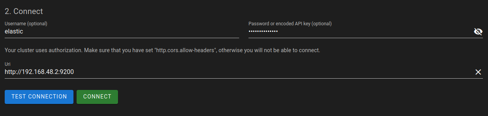

# Bento

Bento is a collection of free and open source microservices used to construct data-focused platforms. 
By adhering to existing and anticipated standardized APIs, it facilitates interactions between 
various -omic science global communities. Its reusable and interoperable components reduce the 
complexity and overhead of constructing data distribution portals.


## Docker-based development and deployment tooling

This repository contains configuration and a command-line utility for deploying
the Bento platform using `docker compose`, and for developing the various services
that make up the Bento platform.


<div style="text-align:center">
  
</div>


<br />

## Requirements
- Docker >= 19.03.8
- Docker Compose >= 2.14.0 (plugin form: you should have the `docker compose` command available, without a dash)


<br />

## Migration documents

* [v14 to v15](./docs/migrating_to_15.md)
* [v13 to v14](./docs/migrating_to_14.md)
* [v12 to v13](./docs/migrating_to_13.md)
* [v2.11 to v12](./docs/migrating_to_12.md)
* [v2.10 to v2.11](./docs/migrating_to_2_11.md)


<br />

## `bentoctl`: the Bento deployment command line management tool

This command line tool offers a series of commands and parameters that are helpful to set up the Docker environment for 
Bento services. It is designed to facilitate fast development and have better cross-platform compatibility versus the 
Makefile.

### Prerequisites

This CLI is specified by a Python module, `py_bentoctl`, launched by a Bash script, 
`./bentoctl.bash`. The Bash wrapper loads various `.env` files to set up the Bento environment.

The `bentoctl` script depends on Python packages, we recommend using a virtual environment for this.

```bash
# Create a venv under ./env
python3 -m venv env

# Activate the python env
source env/bin/activate

# Install dependencies
pip3 install -r requirements.txt
```

To make interacting with the CLI quicker, consider adding an alias for calling `bentoctl.bash`, putting the following
in your `.bash_aliases`, `.bash_profile` or `.zshrc` file:

**Bash/ZSH:** `alias bentoctl="./bentoctl.bash"`

For a quick setup, use the following to append the alias to the file of your choice.

```bash
# Optional: create an alias for bentoctl (run from project's root)
echo "alias bentoctl=${PWD}/bentoctl.bash" > ~/.bash_aliases

# Now RESTART your terminal and re-source the virtualenv, OR run:
source ~/.bash_aliases

# Then, use your alias!
bentoctl --help
```

### Usage

For an overview of `bentoctl`'s features, type the following from the root of the project:

```bash
./bentoctl.bash
```

> **Note:** the flags `--debug, -d` are intended for interactive remote Python debugging of the `bentoctl` module 
> itself. See [VSCode instructions](https://code.visualstudio.com/docs/python/debugging#_local-script-debugging) or 
> [PyCharm instructions](https://www.jetbrains.com/help/pycharm/remote-debugging-with-product.html) for IDE setup.


<br />

## Installation

### 1. Provision configuration files

#### Instance-specific environment variable file: `local.env`

Depending on your use, development or deployment, you will need to copy the right template file
to `local.env` in the root of the `bentoV2` folder:

```bash
# Dev
cp ./etc/bento_dev.env local.env

# Deployment
cp ./etc/bento_deploy.env local.env
```

Then, modify the values as seen; depending on if you're using the instance for development or deployment.


##### Development example

The below is an example of a completed development configuration:

```bash
# in local.env:

MODE=dev

# Gateway/domains -----------------------------------------------------
BENTOV2_DOMAIN=bentov2.local
BENTOV2_PORTAL_DOMAIN=portal.${BENTOV2_DOMAIN}
BENTOV2_AUTH_DOMAIN=bentov2auth.local
# Unused if cBioPortal is disabled:
BENTOV2_CBIOPORTAL_DOMAIN=cbioportal.${BENTOV2_DOMAIN}
# ---------------------------------------------------------------------

# Feature switches ----------------------------------------------------
BENTOV2_USE_EXTERNAL_IDP=0
BENTOV2_USE_BENTO_PUBLIC=1
BENTOV2_PRIVATE_MODE=false

BENTO_CBIOPORTAL_ENABLED=false
# ---------------------------------------------------------------------

# set this to a data storage location, optionally within the repo itself, like: /path-to-my-bentov2-repo/data
BENTOV2_ROOT_DATA_DIR=./data

# Auth ----------------------------------------------------------------
#  - Session secret should be set to a unique secure value.
#    this adds security and allows sessions to exist across gateway restarts.
#     - Empty by default, to be filled by local.env
#  - IMPORTANT: set before starting gateway
BENTOV2_SESSION_SECRET=my-very-secret-session-secret  # !!! ADD SOMETHING MORE SECURE !!!

#  - Set auth DB password if using a local IDP
BENTO_AUTH_DB_PASSWORD=some-secure-password

BENTOV2_AUTH_ADMIN_USER=admin
BENTOV2_AUTH_ADMIN_PASSWORD=admin  # !!! obviously for dev only !!!

BENTOV2_AUTH_TEST_USER=user
BENTOV2_AUTH_TEST_PASSWORD=user  # !!! obviously for dev only !!!

#  - WES Client ID/secret; client within BENTOV2_AUTH_REALM
BENTO_WES_CLIENT_ID=wes
BENTO_WES_CLIENT_SECRET=
# --------------------------------------------------------------------

# Gohan
BENTOV2_GOHAN_ES_PASSWORD=devpassword567

# Katsu
BENTOV2_KATSU_DB_PASSWORD=devpassword123
BENTOV2_KATSU_APP_SECRET=some-random-phrase-here   # !!! ADD SOMETHING MORE SECURE !!!

# Development settings ------------------------------------------------

# - Git configuration
BENTO_GIT_NAME=David  # Change this to your name
BENTO_GIT_EMAIL=do-not-reply@example.org  # Change this to your GitHub account email
```

If the internal OIDC identity provider (IdP) is being used (by default, Keycloak), variables specifying default 
credentials should also be provided. The *admin* credentials are used to connect to the Keycloak UI for authentication 
management (adding users, getting client credentials, ...). The *test* credentials will be used to authenticate on the 
Bento Portal.

```bash
BENTOV2_AUTH_ADMIN_USER=testadmin
BENTOV2_AUTH_ADMIN_PASSWORD=testpassword123

BENTOV2_AUTH_TEST_USER=testuser
BENTOV2_AUTH_TEST_PASSWORD=testpassword123
```

If using an *external* identity provider, adjust the following auth variables according to the external IdP's 
specifications:

```bash
BENTOV2_AUTH_CLIENT_ID=local_bentov2
BENTOV2_AUTH_REALM=bentov2

BENTOV2_AUTH_WELLKNOWN_PATH=/auth/realms/${BENTOV2_AUTH_REALM}/.well-known/openid-configuration
```

#### `bento_public` configuration

Then, copy the `bento_public` configuration file to its correct location for use by Katsu, 
Bento's clinical/phenotypic metadata service:

```bash
# public service configuration file. Required if BENTOV2_USE_BENTO_PUBLIC flag is set to `1`
# See Katsu documentation for more information about the specifications
cp ./etc/katsu.config.example.json ./lib/katsu/config.json
```


### 2. *Development only:* create self-signed TLS certificates 

First, set up your local Bento and Keycloak hostnames (something like `bentov2.local`, `portal.bentov2.local`, and 
`bentov2auth.local`) in the `.env` file. You can then create the corresponding TLS certificates for local development.

Setting up the certificates with `bentoctl` can be done in a single command.
From the project root, run

```bash
./bentoctl.bash init-certs
```

> **NOTE:** This command will skip all certificate generation if it detects previously created files. 
> To force an override, simply add the option `--force` / `-f`.

After creating the three certificates, it is worth ensuring your browser has security exceptions for these
certificates and domains. Navigate to each of the three domains mentioned above and add security exceptions
to ensure cross-origin requests will occur correctly.


### 3. *Development only:* Hosts file configuration

Ensure that the local domain names are set in the machines `hosts` file (for Linux users, this is likely 
`/etc/hosts`, and in Windows, `C:\Windows\System32\drivers\etc\hosts`) pointing to either `localhost`, `127.0.0.1`, 
or `0.0.0.0`, depending on whichever gets the job done on your system.

With the default development configuration, this might look something like:

```
# ... system stuff above
127.0.0.1	bentov2.local
127.0.0.1	portal.bentov2.local
127.0.0.1	bentov2auth.local
# ... other stuff below
```

If you are working with cBioPortal, you will need another line:
```
# ...
127.0.0.1   cbioportal.bentov2.local
# ...
```

Editing `/etc/hosts` is **not needed** in production, since the domains should have DNS records.

Make sure these values match the values in the `.env` file and what was issued in the self-signed certificates, as 
specified in the step above.


### 4. Initialize and boot the gateway


> NOTE: `./bentoctl.bash` commands seen here aren't the only tools for operating this cluster. 
> Run `./bentoctl.bash --help` for further documentation.


```bash
# Once the certificates are ready, initialize various aspects of the cluster:
./bentoctl.bash init-all
# Which is equivalent to:

#   # Once the certificates are ready, initialize the cluster configs secrets
#   ./bentoctl.bash init-dirs
#   ./bentoctl.bash init-docker
#   ./bentoctl.bash init-secrets
#   
#   # Initialize bento_web and bento_public
#   ./bentoctl.bash init-web private
#   ./bentoctl.bash init-web public

# If you are running the bentoV2 with the use of an internal identity provider (defaults to Keycloak), 
# i.e setting BENTOV2_USE_EXTERNAL_IDP=0, run both
./bentoctl.bash run auth
./bentoctl.bash run gateway
# and
./bentoctl.bash init-auth
```

**If using an external identity provider**, only start the cluster's gateway
after setting `CLIENT_SECRET` in your local environment file:

```bash
./bentoctl.bash run gateway
```


#### Note on Keycloak

This last step boots and configures the local OIDC provider (**Keycloak**) container and reconfigures the gateway to 
utilize new variables generated during the OIDC configuration.

> NOTE: by default, the `gateway` service *does* need to be running for this to work as the configuration will pass via 
> the URL set in the `.env` file which points to the gateway.
>
> If you do not plan to use the built-in OIDC provider, you will have to handle auth configuration manually.


### 5. Configure permissions

#### a. Create superuser permissions in the new Bento authorization service

First, run the authorization service and then open a shell into the container:

```bash
./bentoctl.bash run authz
./bentoctl.bash shell authz
```

Then, run the following command for each user ID you wish to assign superuser permissions to:

```bash
bento_authz assign-all-to-user iss sub
```

Where `iss` is the issuer (for example, `https://bentov2auth.local/realms/bentov2`) and `sub` is the user (subject) ID,
which in Keycloak should be a UUID.

#### b. Create grants for the Workflow Execution Service (WES) OAuth2 client

Run the following commands to set up authorization for the WES client:

```bash
# This grant is a temporary hack to get permissions working for v12/v13. In the future, it should be removed.
bento_authz create grant \
  '{"iss": "ISSUER_HERE", "client": "wes"}' \
  '{"everything": true}' \
  'view:private_portal'

# This grant gives permission to access and ingest data into all projects
bento_authz create grant \
  '{"iss": "ISSUER_HERE", "client": "wes"}' \
  '{"everything": true}' \
  'query:data' 'ingest:data'
```

#### c. *Optional step:* Assign portal access to all users in the instance realm

We added a special permission, `view:private_portal`, to Bento v12/v13 in order to carry forward the current
'legacy' authorization behaviour for one more major version. This permission currently behaves as a super-permission,
allowing all actions within the private portal. **However,** in the future, this permission will do almost *nothing.*

To carry forward legacy behaviour of all users in the instance realm being able to do everything, run the following
command in the authorization service container:

```bash
# Create the grant
bento_authz create grant \
  '{"iss": "ISSUER_HERE", "client": "WEB_CLIENT_ID_HERE"}' \
  '{"everything": true}' \
  'view:private_portal'
```

Where `WEB_CLIENT_ID_HERE` is the OAuth2 client the web portal uses, i.e., the 
value in the `BENTOV2_AUTH_CLIENT_ID` environment variable. On local instances, 
this is set to `local_bentov2` by default.


### 6. *Production only:* set up translations for Bento-Public

Now that Bento Public has been initialized by either `./bentoctl.bash init-all` or `./bentoctl.bash init-web public`,
adjust the default translation set as necessary:

```js
// lib/public/translations/<en|fr>.json

{
  "Age": "Age",
  "Sex": "Sex",
  "Verbal consent date": "Verbal Consent Date",
  "Functional status": "Functional Status",
  "Lab Test Result": "Lab Test Results",
  "Experiment Types": "Experiment Types",
  "Demographics": "Demographics",
  "MALE": "MALE",
  "FEMALE": "FEMALE",
  "I have no problems in walking about": "I have no problems in walking about",
  "Results": "Results"
}


{
  "MALE": "HOMME",
  "FEMALE": "FEMME",
  "Age": "Âge",
  "Sex": "Sexe",
  "Demographics": "Démographie",
  "Verbal consent date": "Date de consentement verbal",
  "Functional status": "Statut fonctionnel",
  "Lab Test Result": "Résultats des tests de laboratoire",
  "Experiment Types": "Types d'expériences",
  "I have no problems in walking about": "Je n’ai aucun problème à marcher",
  "Results": "Résultats"
}
```


### 7. Start the cluster

```bash
./bentoctl.bash run all
# or
./bentoctl.bash run
# (these are synonymous)
```

to run all Bento services.


#### Stopping and cleaning the cluster

Run

```bash
./bentoctl.bash stop all
```

to shut down the whole cluster.

To remove the Docker containers, run the following:

```bash
./bentoctl.bash clean all
```

> NOTE: application data does persist after cleaning 
> (depending on data path, e.g., `./data/[auth, drs, katsu]/...` directories)


### 8. Set up Gohan's gene catalogue (*optional*; required for gene querying support)

Upon initial startup of a fresh instance, it may of use, depending on the use-case, to perform the following:

```
# navigate to:
https://portal.bentov2.local/api/gohan/genes/ingestion/run
# to trigger Gohan to download the default GenCode .gtk files from the internet and process them

# - followed up by
https://portal.bentov2.local/api/gohan/genes/ingestion/requests
# to keep up with the process

# the end results can be found at
https://portal.bentov2.local/api/gohan/genes/overview
```


<br />

## Development

### Accessing containers with `bentoctl`

To start a shell session within a particular container, use the following command (here, `web` is used as an example):

```bash
./bentoctl.bash shell web
```

Optionally, the shell to run can be specified via `--shell /bin/bash` or `--shell /bin/sh`.


### Working on `web` (as an example)

To work on the `bento_web` repository within a BentoV2 environment, run the following command:

```bash
./bentoctl.bash work-on web
```

This will clone the `bento_web` repository into `./repos/web` if necessary, pull the local 
development image, and start it in local mode. In this mode, the container has a volume mapping
to the `./repos/web` directory, which means on-the-fly Webpack building will be available. 

All local-mode services are inherently in development mode, even if `MODE=prod` globally, 
through inheritance of Compose files.

You can find the default image tag variables in `./etc/bento.env` and overwrite them in `local.env`, look for the 
pattern `BENTOV2_[name]_VERSION`. 

The version tags correspond to the PR **number** (not its name), e.g. `BENTOV2_WEB_VERSION=pr-216` indicates that the 
image was built from PR #216 in bento_web. 

**Note: Most of the time, you will not need to worry about changing this, 
unless changes were made to the dev image's entrypoint.**

### Where are the Docker images?

By default, the images used are those built by GitHub CI workflows, triggered by commit and PR events and published 
to the Bento images [registry](https://github.com/orgs/bento-platform/packages). If after changing the version tag of 
an image the service's container can no longer be created, it is probably because the tag does not exist on GitHub.

To remediate this, you have two options:
- Create a PR for the branch you want to work on, in order to trigger a CI workflow that will build an image tagged 
  with the PR number (**prefered**)
- Manually build and tag a docker image on your machine (**avoid when possible**)

### Local `bento_web` image example

**Note: this approach is a last resort for local development only. In some situations, we cannot always assume that 
working CI artifacts are available for every service used by Bento.**


For the example, lets assume we changed `BENTOV2_WEB_VERSION` to be equal to `localonly`, which automatically 
makes `BENTOV2_WEB_VERSION_DEV=localonly-dev`.

```bash
# Switch web to local mode
bentoctl work-on web

# Move to cloned local service directory
cd ./repos/web

# Checkout to a specific branch, or create a new one
git checkout [...]

# Build the dev.Dockerfile on your machine, using the env variables values
# Tag 1 => BENTOV2_WEB_IMAGE:BENTOV2_WEB_VERSION
# Tag 2 => BENTOV2_WEB_IMAGE:BENTOV2_WEB_VERSION_DEV
docker build -f dev.Dockerfile . \
  -t ghcr.io/bento-platform/bento_web:localonly
  -t ghcr.io/bento-platform/bento_web:localonly-dev

# Back to root
cd ../../

# Start web with your local image
./bentoctl.bash run web
```

⚠️ **Warning for local development** ⚠️

In local mode, be sure to navigate to the cloned repository `./repos/web/` (or any other service repo you want to work 
on locally), and checkout on the PR branch from which the dev Docker image was built. 

#### Migrating the repository from v2.10 and prior

Move your local `bento_web` project to the `./repos` directory (named `web`):

```bash
mv ./path/to/my/bentoweb ./repos/web
```

You will then have `repos/web` available for the `./bentoctl.bash work-on web` command, which will spin up the 
`web` container tethered to your local directory with a Docker volume. Internally, 
`npm run watch` is executed so changes made locally will be reflected in the container.

> Note: if you get stuck on an NGINX `500 Internal Service Error`, give it another minute to spin up. If it persists, 
> run `./bentoctl.bash shell web` to access the container, and then run `npm run watch` manually.


### Switching `web` back to a pre-built version

In the section above, we switched `web` to a local version where the code is attached to the container via a Docker
bind mount (i.e., a filesystem path volume). To switch back to a pre-built version of `web`, run the following command:

```bash
./bentoctl.bash prebuilt web
```

This will work for any service where both a local development and pre-built image exist.


### Communicating with services (in development)

When `MODE=dev`, some service containers are bound to ports on the host, so debugging can be done without
going through the gateway.

The following is a list of all host port allocations for Bento services in development mode:

| Service          | Port | Debugger Port |
|------------------|------|---------------|
| Adminer          | 8080 | `N/A`         |
| Aggregation      | 9500 | 5684          |
| Beacon           | 5000 | 5683          |
| cBioPortal       | 8089 | `N/A`         |
| Drop Box         | 6000 | Unimplemented |
| DRS              | 7007 | 5682          |
| Elasticvue       | 8081 | `N/A`         |
| Event relay      | 8750 | Unimplemented |
| Katsu            | 8000 | 5432          |
| Notification     | 8500 | 5681          |
| Public           | 8090 | Unimplemented |
| Redis            | 6379 | `N/A`         |
| Service Registry | 5010 | Unimplemented |
| WES              | 9250 | 5680          |


### Using Adminer

An [Adminer](https://www.adminer.org/) container is deployed in dev and local mode, it can be used to inspect the
Katsu database during development.

Go to `localhost:8080` to access the login page. Fill the fields with the values shown below, using the value of
`BENTOV2_KATSU_DB_PASSWORD` for the password field.


### Using Elasticvue

An [Elasticvue](https://github.com/cars10/elasticvue) container is also deployed in dev and local mode, 
allowing users to inspect the Gohan Elasticsearch node in a GUI.

Go to `localhost:8081` to access the Elasticvue interface. Fill the username field with `elastic` and the password 
field with the value of `BENTOV2_GOHAN_ES_PASSWORD`. The Uri field must use the IP of the gohan-es container on 
port 9200 (e.g. http://192.168.48.2:9200), it can be found with this command:
`docker inspect bentov2-gohan-elasticsearch | grep -i ipaddress`

Note: the CORS instructions have already been taken care of in the `docker-compose.dev.yaml` file.




### Converting Phenopackets

Phenopackets JSON documents can be converted from [V1](https://phenopacket-schema.readthedocs.io/en/1.0.0/toplevel.html) 
to [V2](https://phenopacket-schema.readthedocs.io/en/2.0.0/toplevel.html) using `bentoctl` and 
[Phenopacket-tools](https://github.com/phenopackets/phenopacket-tools) as its backend.

For the `bentoctl convert-pheno` command to work, you need to:
1. [Download](http://phenopackets.org/phenopacket-tools/stable/tutorial.html#download-phenopacket-tools) a Phenopacket-tools release.
2. Unzip its content and place the .jar file somwhere safe.
3. Specify the .jar path in `local.env` with the `PHENOTOOL_JAR_PATH` variable

You can then convert a file with:
```shell
bentoctl convert-pheno <source> <target>
```

If the `target` argument is not provided, `bentoctl` will append "_pheno_v2" to the source file's name and save it in its 
parent directory.


<br />

## Testing

First, head on over to https://github.com/mozilla/geckodriver/releases and download the latest geckodriver.

Decompress the .tar.gz or .zip and move the `geckodriver` over to the `./etc/tests/integration` directory. After that, 
simply run
```
make run-tests
```

This will run a set of both unit `(TODO)` and integration tests. See the `Makefile` for more details


<br />

## Troubleshooting

[Troubleshooting guide.](./docs/trouble_shooting.md)
