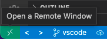

# Using Bento with Dev-containers in VS Code


When a development container is running, the local repository containing the
application code is mounted as a local volume within the container.
It's possible to attach a VS Code instance to the running container so that
the IDE has directly access to the environment within the container.
The advantages are:
- The VS Code terminal is the container local shell
- The python interpreter used by VS Code is the one running in the container
- The python modules are resolved based on the modules installed within the container
- A debugger can be attached

# Prerequisites
## VS Code extensions
The following extension is required for enabling remote development
- [Remote - Containers](https://marketplace.visualstudio.com/items?itemName=ms-vscode-remote.remote-containers)

The following extension is helpful for managing Docker containers
- [Docker](https://marketplace.visualstudio.com/items?itemName=ms-azuretools.vscode-docker)

## Attach VS Code to a running container
- Build the container in dev mode. This is necessary to have the local workspace For example:
```terminal
make stop-katsu
make clean-katsu
make run-katsu-dev
```
Other services available are drs and wes

- In VS Code, with the workspace opened, click on the Remote Quick Access button
in the status bar, and select "Attach to Running Container" from the drop-down menu.
This will install the VS Code server in the container after a few minutes.
VS Code will detect that the project is python based and will install extensions
for python development. This will require reloading the window once all the
installation steps have been completed.



## Using the debugger
Debugging is done using the debugpy module. For it to work, it must be installed
in the container (usually via the Dockerfile) and invoked when running the application.
```Dockerfile
# Dockerfile
RUN pip install debugpy -r requirements.txt;
```
```
# Docker compose (note the threads parameter is set to 1)
entrypoint:
      - (...) gunicorn chord_metadata_service.metadata.wsgi:application -w 1 --threads 1 -b 0.0.0.0:8080
```
```python
# For example in Django wsgi.py
import debugpy
debugpy.listen(("0.0.0.0", 5678))
```

### VS Code configuration
The port configuration for the debugger is passed using the file `launch.json`
located in the `.vscode/` folder of the workspace.
```json
{
  "version": "0.2.0",
  "configurations": [
    {
      "name": "Python: Attach Debugger",
      "type": "debugpy",
      "request": "attach",
      "listen": {
          "host": "0.0.0.0",
          "port": 5678
      }
    }
  ]
}
```

### Debugging in VS Code
Add a breakpoint in the code to debug. Click on the debugger button,
and choose "Python: Attach Debugger" in the drop-down menu.
Once the debugger is attached (status is displayed in the Debug Console), launch a request. The execution should stop at breakpoint where the current stack environment
may be explored (variables content, execution stack, etc...)