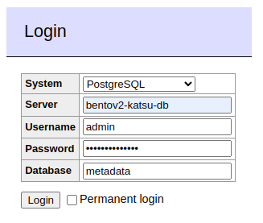
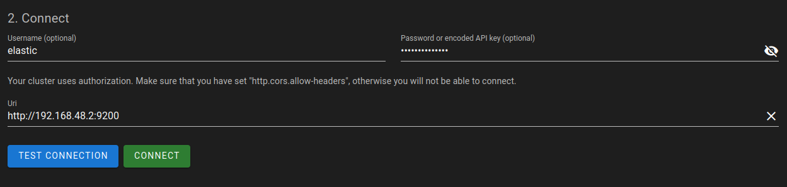

# Development

Before running any installation steps, make sure you've 
[set up `bentoctl` and have activated its virtual environment](./bentoctl.md).

## Accessing containers with `bentoctl`

To start a shell session within a particular container, use the following command (here, `web` is used as an example):

```bash
./bentoctl.bash shell web
```

Optionally, the shell to run can be specified via `--shell /bin/bash` or `--shell /bin/sh`.


## Working on `web` (as an example)

To work on the `bento_web` repository within a BentoV2 environment, run the following command:

```bash
./bentoctl.bash work-on web
```

This will clone the `bento_web` repository into `./repos/web` if necessary, pull the local 
development image, and start it in local mode. In this mode, the container has a volume mapping
to the `./repos/web` directory, which means on-the-fly Webpack building will be available. 

All local-mode services are inherently in development mode, even if `MODE=prod` globally, 
through inheritance of Compose files.

You can find the default image tag variables in `./etc/bento.env` and overwrite them in `local.env`, look for the 
pattern `BENTOV2_[name]_VERSION`. 

The version tags correspond to the PR **number** (not its name), e.g. `BENTOV2_WEB_VERSION=pr-216` indicates that the 
image was built from PR #216 in bento_web. 

**Note: Most of the time, you will not need to worry about changing this, 
unless changes were made to the dev image's entrypoint.**

## Where are the Docker images?

By default, the images used are those built by GitHub CI workflows, triggered by commit and PR events and published 
to the Bento images [registry](https://github.com/orgs/bento-platform/packages). If after changing the version tag of 
an image the service's container can no longer be created, it is probably because the tag does not exist on GitHub.

To remediate this, you have two options:
- Create a PR for the branch you want to work on, in order to trigger a CI workflow that will build an image tagged 
  with the PR number (**prefered**)
- Manually build and tag a docker image on your machine (**avoid when possible**)

## Local `bento_web` image example

**Note: this approach is a last resort for local development only. In some situations, we cannot always assume that 
working CI artifacts are available for every service used by Bento.**


For the example, lets assume we changed `BENTOV2_WEB_VERSION` to be equal to `localonly`, which automatically 
makes `BENTOV2_WEB_VERSION_DEV=localonly-dev`.

```bash
# Switch web to local mode
bentoctl work-on web

# Move to cloned local service directory
cd ./repos/web

# Checkout to a specific branch, or create a new one
git checkout [...]

# Build the dev.Dockerfile on your machine, using the env variables values
# Tag 1 => BENTOV2_WEB_IMAGE:BENTOV2_WEB_VERSION
# Tag 2 => BENTOV2_WEB_IMAGE:BENTOV2_WEB_VERSION_DEV
docker build -f dev.Dockerfile . \
  -t ghcr.io/bento-platform/bento_web:localonly \
  -t ghcr.io/bento-platform/bento_web:localonly-dev

# Back to root
cd ../../

# Start web with your local image
./bentoctl.bash run web
```

⚠️ **Warning for local development** ⚠️

In local mode, be sure to navigate to the cloned repository `./repos/web/` (or any other service repo you want to work 
on locally), and checkout on the PR branch from which the dev Docker image was built. 

### Migrating the repository from v2.10 and prior

Move your local `bento_web` project to the `./repos` directory (named `web`):

```bash
mv ./path/to/my/bentoweb ./repos/web
```

You will then have `repos/web` available for the `./bentoctl.bash work-on web` command, which will spin up the 
`web` container tethered to your local directory with a Docker volume. Internally, 
`npm run watch` is executed so changes made locally will be reflected in the container.

> Note: if you get stuck on an NGINX `500 Internal Service Error`, give it another minute to spin up. If it persists, 
> run `./bentoctl.bash shell web` to access the container, and then run `npm run watch` manually.


## Switching `web` back to a pre-built version

In the section above, we switched `web` to a local version where the code is attached to the container via a Docker
bind mount (i.e., a filesystem path volume). To switch back to a pre-built version of `web`, run the following command:

```bash
./bentoctl.bash prebuilt web
```

This will work for any service where both a local development and pre-built image exist.


## Communicating with services (in development)

When `MODE=dev`, some service containers are bound to ports on the host, so debugging can be done without
going through the gateway.

The following is a list of all host port allocations for Bento services in development mode:

| Service          | Port | Debugger Port |
|------------------|------|---------------|
| Adminer          | 8080 | `N/A`         |
| Aggregation      | 9500 | 5684          |
| Beacon           | 5000 | 5683          |
| cBioPortal       | 8089 | `N/A`         |
| Drop Box         | 6000 | Unimplemented |
| DRS              | 7007 | 5682          |
| Elasticvue       | 8081 | `N/A`         |
| Event relay      | 8750 | Unimplemented |
| Katsu            | 8000 | 5678          |
| Katsu DB         | 5432 | `N/A`         |
| Notification     | 8500 | 5681          |
| Public           | 8090 | Unimplemented |
| Redis            | 6379 | `N/A`         |
| Reference        | 9510 | 9501          |
| Reference DB     | 9512 | `N/A`         |
| Service Registry | 5010 | Unimplemented |
| WES              | 9250 | 5680          |


## Local NPM package development

The [bento_web](https://github.com/bento-platform/bento_web) and 
[bento_public](https://github.com/bento-platform/bento_public) projects use Bento specific packages for 
[charts](https://github.com/bento-platform/bento_charts/) and 
[auth](https://github.com/bento-platform/bento_auth_js).

In production, these packages are installed from the NPM registry.
When developing simultanuously on a given web app and package, 
it is helpful to be able to use the locally built package without 
having to publish unfinished dev packages to NPM.

For this use case:


```shell
# cd to the package's code directory
cd ../bento_charts # assumes bento_charts is in parent dir

# Build and pack the package as a .tgz file
npm run buildpack

# Go back to Bento's dir
cd ../bento

# Copy the packaged file to the Bento packs dir
cp ../bento_charts/packs/*.tgz ./packs

# Start a web app in dev mode
bentoctl dev web

# Open a shell in the container (or open the dev container with Code)
bentoctl shell web

# Install the package using the mounted pack file on /packs
npm install /packs/bento-charts-2.5.0.tgz
```

If subsequent modifications are made to the package's code, you will need to create a new pack file 
and install it again in the app with `npm install`.


## Adding services

See [`adding-services.md`](./adding-services.md) for some considerations when adding new services to Bento.


## Using Adminer

An [Adminer](https://www.adminer.org/) container is deployed in dev and local mode, it can be used to inspect the
Katsu database during development.

Go to `localhost:8080` to access the login page. Fill the fields with the values shown below, using the value of
`BENTOV2_KATSU_DB_PASSWORD` for the password field.




## Using Elasticvue

An [Elasticvue](https://github.com/cars10/elasticvue) container is also deployed in dev and local mode, 
allowing users to inspect the Gohan Elasticsearch node in a GUI.

Go to `localhost:8081` to access the Elasticvue interface. Fill the username field with `elastic` and the password 
field with the value of `BENTOV2_GOHAN_ES_PASSWORD`. The Uri field must use the IP of the gohan-es container on 
port 9200 (e.g. http://192.168.48.2:9200), it can be found with this command:
`docker inspect bentov2-gohan-elasticsearch | grep -i ipaddress`

Note: the CORS instructions have already been taken care of in the `docker-compose.dev.yaml` file.




## Converting Phenopackets

Phenopackets JSON documents can be converted from [V1](https://phenopacket-schema.readthedocs.io/en/1.0.0/toplevel.html) 
to [V2](https://phenopacket-schema.readthedocs.io/en/2.0.0/toplevel.html) using `bentoctl` and 
[Phenopacket-tools](https://github.com/phenopackets/phenopacket-tools) as its backend.

See the relevant guide: [Converting Phenopackets from V1 to V2 using `bentoctl`](./phenopackets_v1_to_v2.md)
