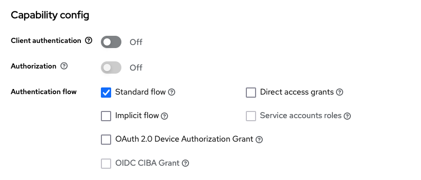
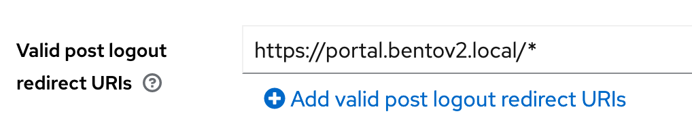

# Migrating to Bento v12

The following is a migration guide for going from Bento v2.11 to Bento v12.

Note the change in versioning scheme for this release; we dropped the `2.` prefix.


## 1. Update Docker containers

The following commands:

* Stop the cluster
* Pull the latest images
* Re-initialize Docker networks
* Start the cluster again


```bash
./bentoctl.bash stop
./bentoctl.bash pull
./bentoctl.bash init-docker
./bentoctl.bash run
```


## 2. Convert the Keycloak client to be `public` and enable PKCE

To do this, sign in to Keycloak as an administrator and navigate to the realm & Bento client.
Then, turn off "Client authentication" and make sure the settings are as follows, with only
"Standard flow" enabled and **save your changes.**



Then, make sure to set a valid **post-logout redirect URI** if not already done. Use the value 
`https://portal.bentov2.local/*`, replacing the domain with whatever your portal URL is:



Then, **enable PKCE** by going to the "Advanced" tab, scrolling down to "Advanced settings", and setting the
`Proof Key for Code Exchange Code Challenge Method` setting to `S256`. Finally, **save your changes** again.

In this tab, **make sure** "Access Token Lifespan" is also set to a finite value. As a default, use something short,
like 15 minutes.

To clean up your `local.env` file, remove the entry that looks like this:

```bash
CLIENT_SECRET=some-secret-here
```


## 3. Create a new client for any bots (*if needed*) 

In Keycloak, create separate clients for any bots. These should have "Client authentication" **ON**.

For the legacy bot authentication method, "Direct access grants" will need to be **ON** as well.

For a more modern bot approach, turn "Direct access grants" **OFF** and turn "Service account roles" **ON**,
thereby enabling the "Client credentials" authentication flow.


## 4. Create superuser permissions in the new Bento authorization service

First, open a shell in the authorization service container:

```bash
./bentoctl.bash shell authz
```

Then, run the following command for each user ID you wish to assign superuser permissions to:

```bash
bento_authz assign-all-to-user iss sub
```

Where `iss` is the issuer (for example, `https://bentov2auth.local/realms/bentov2`) and `sub` is the user (subject) ID,
which in Keycloak should be a UUID.

### *Optional second step:* Assign portal access to all users in the instance realm

We added a special permission, `view:private_portal`, to Bento v12 in order to carry forward the current
'legacy' authorization behaviour for one more major version. This permission currently behaves as a super-permission,
allowing all actions within the private portal. **However,** in the future, this permission will do almost *nothing.*

To carry forward legacy behaviour of all users in the instance realm being able to do everything, run the following
command in the authorization service container:

```bash
# Create the grant
bento_authz create grant \
  '{"iss": "ISSUER_HERE", "client": "WEB_CLIENT_ID_HERE"}' \
  '{"everything": true}' \
  'view:private_portal'
```


## 5. Create bot permissions in the new Bento authorization service (*if needed*)

First, open a shell in the authorization service container if you don't already have one from the step(s) before:

```bash
./bentoctl.bash shell authz
```

Then, run the following commands for each bot client you wish to assign *ingest* permissions to:

```bash
# This grant is a temporary hack to get permissions working for v12. In the future, it should be removed.
bento_authz create grant \
  '{"iss": "ISSUER_HERE", "client": "BOT_CLIENT_ID_HERE"}' \
  '{"everything": true}' \
  'view:private_portal'

# This grant is not used currently, but ensures future permission to ingest data into the project 
# and clear existing data to make room for the new ingested data.
bento_authz create grant \
  '{"iss": "ISSUER_HERE", "client": "BOT_CLIENT_ID_HERE"}' \
  '{"project": "my-automated-project-id"}' \
  'view:runs' 'ingest:data' 'delete:data'
```
