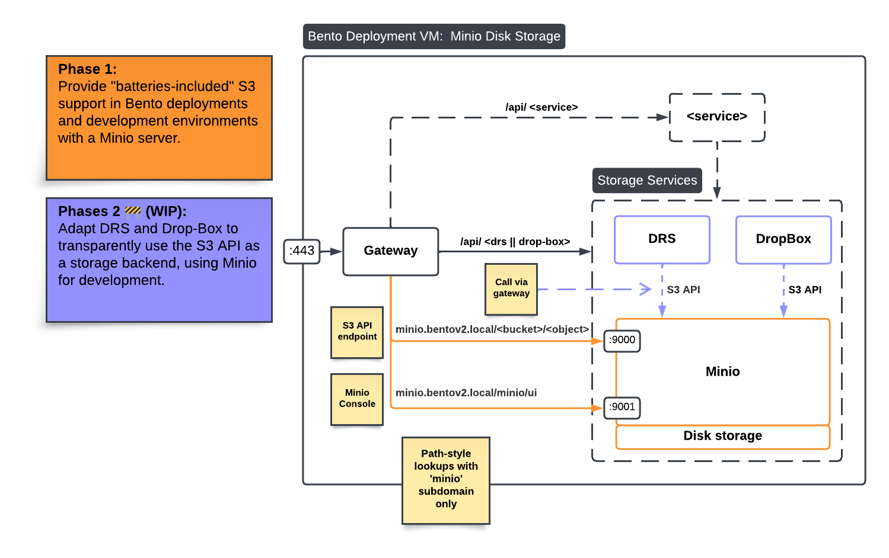

# Bento MinIO

Bento can be deployed with a [MinIO](https://github.com/minio/minio) service.
The MinIO service provides an [S3 compatible API](https://min.io/docs/minio/linux/reference/s3-api-compatibility.html) 
for object storage.

It is mostly intended for development and testing purposes with the S3 API, 
as we are working on enabling S3 storage for Bento.

For deployments, Bento instances requiring large storage capacity should rely on an external managed 
S3 storage provider (AWS, Ceph, production MinIO cluster, etc). 
This will allow Bento deployments to be decoupled from disk storage concerns.

## Routing


**Note:** As shown above, the MinIO service relies on disk storage, which is why
production environments should consider external S3 storage instead.

## Configuration

To enable the MinIO service in a Bento deployment, please follow the instructions bellow.

### Environment variables

Enable MinIO by setting the feature flag and other required variables in `local.env`.

```bash
BENTO_MINIO_ENABLED='true'
BENTO_MINIO_ROOT_USER=root                  # default value, can be changed
BENTO_MINIO_ROOT_PASSWORD=secure-password   # change to a secure pw
BENTO_MINIO_DOMAIN=minio.${BENTOV2_DOMAIN}  # MUST be a subdomain of BENTOV2_DOMAIN
```

### Domain resolution

In a VM using a trusted certificate authority, there should be a DNS record for `BENTO_MINIO_DOMAIN`.

In a local development environment, you must specify how `BENTO_MINIO_DOMAIN` should be resolved, 
simulating a DNS record for self-signed certificates.

Assuming `BENTO_MINIO_DOMAIN=minio.bentov2.local`, add the following line to your `/etc/hosts` file:

```bash
# /etc/hosts
127.0.0.1       minio.bentov2.local
```

### Initialize MinIO certificates, networking and directories

After enabling the MinIO feature flag for the first time and setting domain resolution, 
you must initialize the Docker networks, mounted directories and certs.
```bash
./bentoctl.bash init-certs -f   # creates the self-signed certificate for MinIO
./bentoctl.bash init-docker     # creates the Docker network for MinIO
./bentoctl.bash init-dirs       # creates MinIO's data directory to be mounted
```

### Start MinIO

If all previous steps were performed correctly, you are ready to restart the 
gateway and start the MinIO service!

```bash
# Will recreate the gateway container automatically and start MinIO.
./bentoctl.bash run
```

## Using the console

The console can be accessed using a web browser, simply navigate to [minio.bentov2.local/minio/ui/](https://minio.bentov2.local/minio/ui/).

Authenticate using `BENTO_MINIO_ROOT_USER` and `BENTO_MINIO_ROOT_PASSWORD`.

Once logged in, you can issue access keys. These keys can be used to make 
S3 API calls.

## Using MinIO's S3 API

Assuming you created an access key in the console and saved the values, 
you are ready to make object storage operations through the S3 API.

Interactions between clients and the S3 API all take place over HTTP.
Many CLI tools and libraries are available to simplify these operations.

### S3cmd

[S3cmd](https://s3tools.org/s3cmd) is a popular CLI tool to interact with object stores that
support the S3 protocol, including MinIO.

Once S3cmd is installed on a machine, you can create a s3cmd configuration file for the S3 API
endpoint of your choice.

```bash
# ~/.s3cfg-minio-local
host_base = minio.bentov2.local     # S3 API endpoint (local here)
host_bucket = minio.bentov2.local   
use_https = True                    # Use HTTPS

# For dev self-signed certs only
check_ssl_certificate = False       # Enable if using trusted CA

# Setup access keys
access_key = <OBTAIN FROM MINIO CONSOLE>
secret_key = <OBTAIN FROM MINIO CONSOLE>
```

With the S3cmd config file in place, you can start creating buckets, uploading files, and much more.

```bash
# list buckets (empty at first)
s3cmd -c ~/.s3cfg-minio-local ls

# Create a bucket named 'test'
s3cmd -c ~/.s3cfg-minio-local mb s3://test

# Upload a file to your new bucket!
s3cmd -c ~/.s3cfg-minio-local put some-file.txt s3://test/some-file.txt
```

### Boto3

[Boto3](https://boto3.amazonaws.com/v1/documentation/api/latest/guide/quickstart.html#installation) 
is an official AWS Python package to interact with an S3 compatible object store.

Like S3cmd, it must be configured to use access keys.

Future work on DRS and Drop-Box will involve Boto3 to enable S3 storage in Bento.
