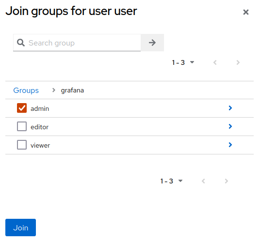
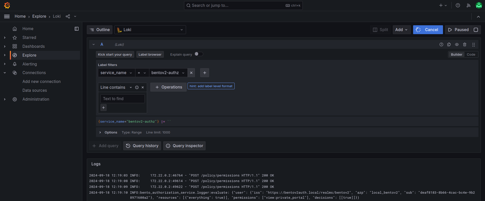

# Bento Monitoring

Previously, the only way to get the logs of a given service was to connect to the the server hosting Bento
and getting the logs directly from Docker.
Since v17, Bento includes tools that allow authenticated and authorized users to explore the services' logs
in a convenient web application.

The stack enabling this is composed by three open-source services:
- Promtail: forwards the logs from Bento's services to the log database
- Loki: stores the logs from Promtail and serves them to Grafana
- Grafana: auth protected web application to query and analyse collected logs

## Configuration

Enable monitoring by setting the feature flag

```bash
BENTO_MONITORING_ENABLED='true'
```

Pull the images and prepare the network/directories for monitoring containers:

```bash
./bentoctl.bash pull
./bentoctl.bash init-docker
./bentoctl.bash init-dirs
```

Grafana is configured to only let in authenticated users from Bento's Keycloak realm, 
if they have the required client permissions for Grafana.

Create the Grafana OIDC client, its permissions and group mappings with the following:

```bash
./bentoctl.bash init-auth
```

Set the outputted value for `BENTO_GRAFANA_CLIENT_SECRET` in the `local.env` file and restart Grafana.

```bash
./bentoctl.bash restart grafana
```

## User management

In order for a user to access Grafana, they must belong to a Grafana sub-group in Bento's Keycloak.

Group role-mappings in Keycloak:
- Grafana (parent group, no permission)
    - Admin
        - Editor permissions
        - Administration of Grafana
    - Editor
        - Viewer permissions
        - Can explore logs
        - Can create dashboards for viewers
    - Viewer
        - Can view created dashboards

The `admin`, `editor` and `viewer` roles are Grafana concepts. During authentication, Grafana will synchronize the 
user's roles from Keycloak, and only let the user in if a valid role can be retrieved from the ID token.

The `init-auth` step in the [configuration](#configuration) creates everything needed for this in Keycloak. 

The only remaining step is to add users to Grafana groups:
- In a browser, navigate to the Keycloak admin portal (your `BENTOV2_AUTH_DOMAIN`)
- Authenticate using the admin credentials
- By default the realm will be `Keycloak`, change it to Bento's realm (value of `BENTOV2_AUTH_REALM`)
- Navigate to the `Users` tab
- Select a user
- Select the user's `Groups` tab
- Click on the `Join Group` button
- Select a Grafana sub-group and click on `Join`



## Using Grafana

The user can now connect to `bento_web` and access Grafana from the header tabs!

At the moment, no default dashboards are provided, so only users with `admin` or `editor` roles will have 
access to data.

To look at the raw logs for a service:
- Select the `Explore` tab in Grafana
- Select the `service_name` label filter
- Select a service from the value drop down
- In the top-right, click on `run query`, `live`, or `Last <time frame>` to fetch the logs

The logs will appear at the bottom. The log query can be further modified with operations, allowing you to fine comb
your logs effectively.


