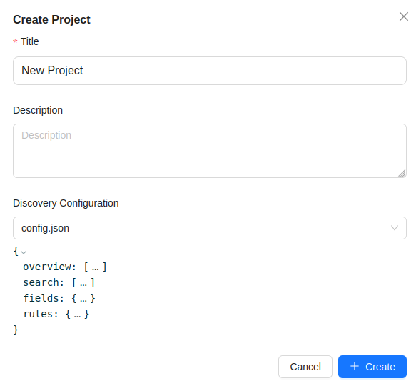
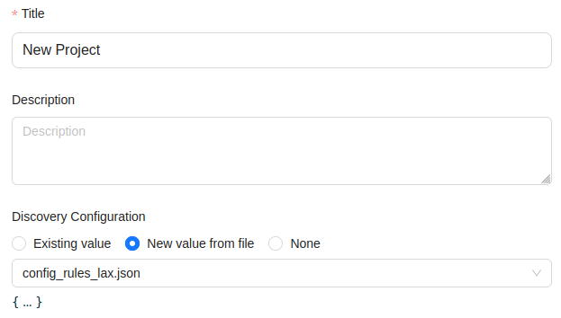

# Public data discovery configuration

New in Bento v17.

Previously, the public data configuration given to Katsu (`lib/katsu/config.json`) was applied on all the metadata 
contained in the service. This configuration declares which fields can be queried publicly for discovery purposes, 
which charts to display and which censorship rules to apply on the results.

Katsu can hold multiple projects/datasets that may use different fields, require specific charts or custom
`extra_properties` schemas at the project level.
Therefore, there is a need to tailor the discovery configuration at different levels to properly represent the 
particularities in the information of a project or dataset.

Bento v17 gives the ability to specify a scoped Discovery configuration at the following levels:
-   Dataset
    -   Optional at dataset creation
    -   For scoped queries on public endpoints targeting a project and dataset:
        -   Katsu will use the dataset's discovery configuration, if one exists.
        -   If no configuration is found, falls back to the parent project's discovery.
-   Project
    -   Optional at project creation
    -   For scoped queries on public endpoints targeting a project only:
        -   Katsu will use the project's discovery configuration, if one exists.
        -   If no configuration is found, falls back to the node's config.
-   Node
    -   Optional during Katsu deployment
    -   Uses the legacy `lib/katsu/config.json` file mount
    -   For non-scoped queries on public endpoints:
        -   Katsu will use the node's discovery, if one exists.
        -   If no node configuration is found, Katsu will respond with a 404 status.
    -   For scoped queries on public endpoints:
        -   Katsu will fallback on the node's discovery if the project and/or dataset in the scope don't have one
        -   If no node configuration is found, Katsu will respond with a 404 status.


## Creating a discovery configuration file.

Follow these steps in order to add public discovery for a given scope.

1. Decide at which level the discovery configuration will be applied.
2. Create a copy of `etc/katsu.config.example.json`, use it as a base template
3. Modify the `fields` section so that it includes the fields of interest.
4. Modify the `search` section, include the fields from the previous section to make them searchable
5. Modify the `overview` section in order to specify which fields should be rendered as charts and how.
6. Set the desired censorship rules in the `rules` section.

The resulting JSON file needs to respect the JSON-schema defined in Katsu [here](https://github.com/bento-platform/katsu/blob/develop/chord_metadata_service/discovery/schemas.py).

## Using a discovery configuration file.

With the valid discovery configuration file in hand, you can now add it to Katsu.

### Apply the discovery configuration at the node level:

This operation must be done by a Bento node administrator.
```bash
# Move the file to Katsu's config volume
cp <discovery config JSON file> ./lib/katsu/config.json

# restart Katsu to load the config.
./bentoctl.bash restart katsu
```

### Apply the discovery configuration at the project or dataset level

These operations must be performed in `bento_web` by an authenticated user 
with the `edit:dataset`, `create:dataset`, `edit:project`, `create:project` permissions.

Before creating/editing a project/dataset to specify a discovery configuration, 
make sure that the JSON file is in Bento's dropbox.

At project/dataset creation, leaving the discovery field empty is permitted.
Specify a discovery config by selecting the desired file from the drop-down options.



During project/dataset editing, three radio buttons are shown, allowing the user to pick the existing value,
a new value from file, or none. The 'none' option is equivalent to leaving the field empty at creation.


