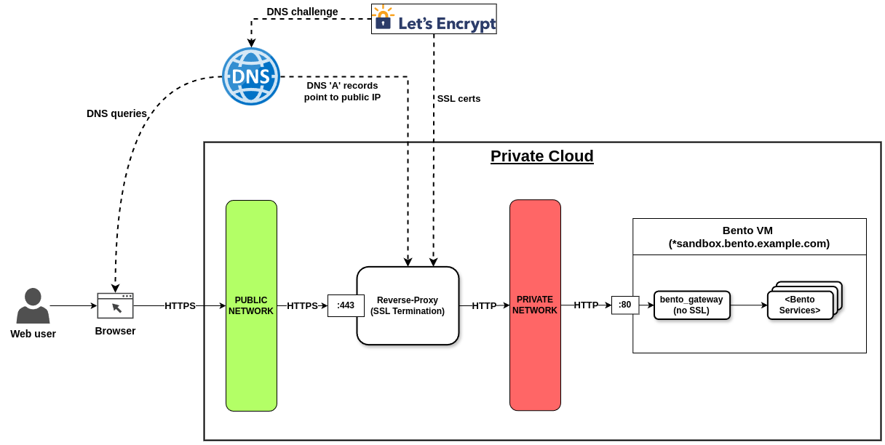

# Bento behind a proxy

A Bento instance is typically deployed on a dedicated VM with a public IP address.

By creating DNS `A` or `CNAME` records pointing hostnames to the VM's IP, deployers
can obtain SSL certificates from Let's Encrypt using `certbot`.

Having a Bento instance on a VM with a public IP is convenient in terms of deployment,
but is a security trade-off, as it exposes the VM's IP and ports to attackers.

A more secure deployment can be achieved by using a VM with no public IP to host Bento
and proxy the traffic through a reverse proxy.

## Using a reverse proxy in front of Bento

### Deployment overview
As an example, let's assume we have the following hostnames to deploy:
- Public dashboard: `sandbox.bento.example.com`
- Portal: `portal.sandbox.bento.example.com`
- Auth: `auth.sandbox.bento.example.com`

We will be using the following deployment infrastructure:
- **Bento VM** (`bento-sandbox`)
    - Linux VM in a private or public cloud
    - On the subnet `private-network`
    - Public IP: `NONE`
    - Private IP: `10.0.0.1`
    - DNS records: `NONE`
- **Reverse Proxy**
    - Has network access to `bento-sandbox (10.0.0.1)` on `private-network`
    - Public IP: `some.public.ip.adr`
    - DNS records:
        - (A) `sandbox.bento.example.com` => `some.public.ip.adr`
        - (A) `*.sandbox.bento.example.com` => `some.public.ip.adr`
    - Manages the SSL certificates for our domains
    - Proxies the requests to the `bento-sandbox` host with SSL termination
        - `sandbox.bento.example.com` => `10.0.0.1:80`
        - `*.sandbox.bento.example.com` => `10.0.0.1:80`



The diagram above illustrates the deployment architecture.

With the Bento VM on a dedicated private network, we can have SSL
termination at the reverse proxy in front of our Bento.
As a result, all the SSL certificates can be managed at the level of the reverse proxy.

### Configure the Bento hosting VM

To run a Bento instance in SSL termination mode:
```bash
# Set feature flag in local.env
BENTO_GATEWAY_USE_TLS='false'

# Start the services
./bentoctl.bash start
```

### Configure the reverse proxy

For this example, we are assuming that the reverse proxy is a Linux VM
on which NGINX has been installed and configured.

You could use another reverse proxy software of your liking, like Traefik or Caddy. 
Alternatively, your reverse proxy could also be a service, like AWS's API Gateway, although this is out of scope for this demonstration.

Assuming a reverse proxy VM with NGINX installed and started, add this
configuration file to the `/etc/nginx/conf.d` directory:

```nginx
map $http_upgrade $connection_upgrade {
  default upgrade;
  '' close;
}

# Redirect HTTP -> HTTPS
server {
  listen 80 ;
  return 301 https://$host$request_uri;
}

# Reject HTTPS requests on unspecified subdomains
server {
  listen 443 ssl;
  ssl_reject_handshake on;
}

server {
  listen 443 ssl;
  # Only accept "sandbox.bento.example.com" and auth|portal subdomains
  server_name sandbox.bento.example.com auth.sandbox.bento.example.com portal.sandbox.bento.example.com;
  
  # Wildcard certificate for *.sandbox.bento.example.com
  ssl_certificate /etc/letsencrypt/live/sandbox.bento.example.com/fullchain.pem;
  ssl_certificate_key /etc/letsencrypt/live/sandbox.bento.example.com/privkey.pem;
 
  location / {
    proxy_set_header    Host $host;
    proxy_set_header    X-Real-IP $remote_addr;

    # Crucial for Keycloak proxying with SSL termination
    proxy_set_header    X-Forwarded-For $proxy_add_x_forwarded_for;
    proxy_set_header    X-Forwarded-Proto $scheme;
    proxy_set_header    X-Forwarded-Host $host;

    proxy_set_header Upgrade $http_upgrade;
    proxy_set_header Connection $connection_upgrade;
    proxy_http_version 1.1;

    # For large requests
    client_body_timeout     660s;
    proxy_read_timeout      660s;
    proxy_send_timeout      660s;
    send_timeout            660s;
    client_max_body_size    200m;
    
    # Bento VM instance IP on the private network
    # On port 80 since we use SSL termination
    proxy_pass  http://10.0.0.1:80;
    proxy_redirect	default;
      
  }

}
```

Then restart the NGINX server to load the new configuration.

If everything was done correctly, you should now be able to reach the Bento instance through the reverse-proxy!

### Proxying multiple Bento instances
If more Bento instances are needed, the same reverse proxy can be used to route traffic.

To do so, one would simply need to:
1. Create and configure a Bento VM on a private network accesible by the reverse-proxy
2. Create new DNS records for the desired domains 
   1. Not necessary if using wildcard DNS records already covering the domain
3. Obtain the certificates for the desired domains on the reverse proxy
   1. Or use wildcard certificates (recommended)
4. Configure the reverse proxy to route traffic to the new instance
   1. Add a conf to `/etc/nginx/conf.d/`
   2. Restart the reverse proxy
